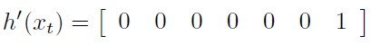

# Estimation Project #

## My Solution ##
This is the README for my project submission. The original project README has be moved to Project - RM.md for reference. 
This has been a challenging project and I enjoyed incorportating the controller from the previous project at the end. The math was challenging at times during the lessons but implementing it in the project framework was a great exercise.


### Step 1: Sensor Noise ###
I solved this one by importing the CSV files into Excel and applying the mean, standard deviation and variance formulas to the data to get the result. See image below. The rounded up values in `SimulatedSensors.txt` matched the result.

<p align="center">
   
   </br></br>
   
</p>

**Screenshot and console output:**

</br>
<p align="center">
   <br/>
   
</p>

### Step 2: Attitude Estimation ###
This step required the implementation of a complementary filter. I chose to use the suggested Quaternions rather than the Eulers that were presented in the lectures to avoid creating another rotation Matrix. The built in `IntegrateBodyRate` function was very helpful as was the ability to easily convert back to Euler angles. My code follows. Credit to section 7.1.2 of [Estimation for Quadrotors](https://www.overleaf.com/read/vymfngphcccj) for explaining the implementation.

```C++
   //use the state to define a quaternion
	Quaternion<float> qt = Quaternion<float>::FromEuler123_RPY(rollEst, pitchEst, ekfState(6));

	//Integrate the measurements
	qt.IntegrateBodyRate((V3D)gyro, dtIMU);

	//Convert back to Euler
	V3F predictedAttitude = (V3F)qt.ToEulerRPY();
	float predictedRoll = predictedAttitude.x;
	float predictedPitch = predictedAttitude.y;
	ekfState(6) = predictedAttitude.z;

	// normalize yaw to -pi .. pi
	if (ekfState(6) > F_PI) ekfState(6) -= 2.f * F_PI;
	if (ekfState(6) < -F_PI) ekfState(6) += 2.f * F_PI;
```
<br/><br/>
**Screenshot and console output**:</br>
<p align="center">
   </br>
   
</p>


### Step 3: Prediction Step ###
There were two parts to this step.

1. Implement the `PredictState` function.
This was not too difficult. The aim was to integrate the velocity and acceleration to get the predicted position and velocity. The `Rotate_BtoI` function made life a lot easier for converting from the body to the inertial frame. 

```c++
	//Integrate position
	predictedState(0) += predictedState[3] * dt;
	predictedState(1) += predictedState[4]* dt;
	predictedState(2) += predictedState[5] * dt; 
	
	//Integrate velocity in the Inertial Frame
	V3F intertialAccel = attitude.Rotate_BtoI(accel);
	predictedState(3) += intertialAccel.x * dt;
	predictedState(4) += intertialAccel.y * dt;
	predictedState(5) += ((float)intertialAccel.z - (float) CONST_GRAVITY) * dt;
```

This produced the desired output:
<p align="center">
   
</p>

2. Covariance prediction
There are two parts to this implemenation. First we had to setup Rbg Prime based on the following matrix:

<p align="center">
   
</p>

The code to implement this was pretty straight forward but it was worth triple checking as I did make an error with one of the entries. Luckily it was corrected before causing any problems.

```C++
	float sinPhi = sin(roll);
	float cosPhi = cos(roll);

	float sinTheta = sin(pitch);
	float cosTheta = cos(pitch);
	
	float sinPsi = sin(yaw);
	float cosPsi = cos(yaw);

	RbgPrime(0, 0) = -cosTheta * sinPsi;
	RbgPrime(0, 1) = -sinPhi * sinTheta * sinPsi - cosPhi * cosPsi;
	RbgPrime(0, 2) = -cosPhi * sinTheta * sinPsi + sinPhi * cosPsi;

	RbgPrime(1, 0) = cosTheta * cosPsi;
	RbgPrime(1, 1) = sinPhi * sinTheta * cosPsi - cosPhi * sinPsi;
	RbgPrime(1, 2) = cosPhi * sinTheta * cosPsi + sinPhi * sinPsi;
```

Next it was time to implement the `Predict` function to predict the current covariance forward by dt using the current accelerations and body rates as input. This required implementing the jacobian (gPrime) and then plugging in all of the variables into the covariance formula.

`gPrime` matrix:
<p align="center">
   
</p>

My code solution as described above:<br/></br>

```C++
//add accelerations to a vector to enable matrix operations
	VectorXf accelVector(3);
	accelVector(0) = accel.x;
	accelVector(1) = accel.y;
	accelVector(2) = accel.z - (float)CONST_GRAVITY;

	gPrime(0, 3) = dt;
	gPrime(1, 4) = dt;
	gPrime(2, 5) = dt;
	gPrime(3, 6) = RbgPrime.row(0).dot(accelVector) * dt;
	gPrime(4, 6) = RbgPrime.row(1).dot(accelVector) * dt;
	gPrime(5, 6) = RbgPrime.row(2).dot(accelVector) * dt;

	//Equation to update the covariance
	ekfCov = gPrime * ekfCov * gPrime.transpose() + Q;
```
<br/> Next it was time to tune the `QPosXYStd` and the `QVelXYStd` process parameters in `QuadEstimatorEKF.txt`, and then finally:

<br/> **The resulting graph:**
<p align="center">
   
</p>


### Step 4: Magnetometer Update ###
The magnetometer update calls the `Update(z, hPrime, R_Mag, zFromX)`. `R-Mag` was provided. The measurement, z, was setup from the magnetometer reading. This left `hPrime` and `zFromX` to be calculated. hPrime was a matter of setting up the the already zero matrix as below. zFromX was retrieved for the state vector and normalised to ensure the drone turns clockwise and counter clockwise appropriately.
<p align="center">
   
</p>

My code to implement the above:<br/>
```C++
	hPrime(0, 6) = 1;
	//current estimated yaw
	zFromX(0) = ekfState(6);

	float estimated_err = magYaw - ekfState(6);
	// normalize yaw to -pi .. pi
	if (estimated_err > F_PI) zFromX(0) += 2.f * F_PI;
	if (estimated_err < -F_PI) zFromX(0) -= 2.f * F_PI;
```
<br/><br/>
Lastly, for this step, it was time to tune the parameter `QYawStd`  in `QuadEstimatorEKF.txt`.<br/><br/>
**Resulting graph and console output:**
<p align="center">
   
</p>
<p align="center">
   
</p>


### Step 5: Closed Loop + GPS Update ###
Similar to the Magnetometer update, the GPS update calls the `Update(z, hPrime, R_GPS, zFromX)`. `R_GPS` is provided and `z` is setup from the GPS measurements vectors `pos` and `vel`. I coded hPrime as the identity matrix below and `zFromX` from the state vector `ekfState`.
<p align="center">
   
</p>

My code to implement the above:<br/>

```C++
	for (int i = 0; i < 6; i++) {
		hPrime(i, i) = 1;
		zFromX(i) = ekfState(i);
	}
```
<br/><br/>
Then it was time to tune the process noise model in `QuadEstimatorEKF.txt` one more time :)!<br/><br/>
**Resulting graph and console output:**
<p align="center">
   
</p>
<p align="center">
   
</p>


### Step 6: Adding Your Controller ###
Now for the big moment - replacing the controller with my controller from the previous project. I must admit - I was nervous and excited to see what would happen. I grabbed my controller and settings (`QuadController.cpp` and `QuadControlParams.txt`) from my [repo](https://github.com/AmitByteOrbit/FCND-Controls.git). I them renamed the project files with the suffix `_original` (which came in handy for the Step 5 write-up) and then dropped in my files. It wasn't a disaster but I needed to spend some time tuning the parameters in  `QuadControlParams.txt` for a while. The end result:

<p align="center">
   
</p>

<p align="center">
   
</p>

Thank you!

